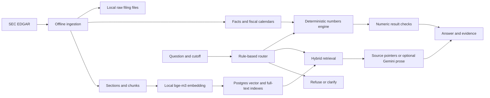
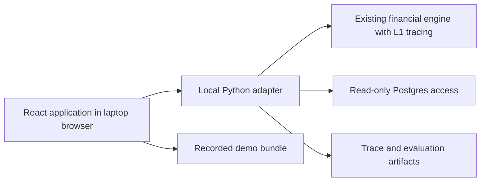

# Showcase 2 — Extended interview UI design reference

**Status:** Extended reference, deferred from v1; no frontend or adapter is implemented.
**Date:** 2026-09-26  
**Audience:** The presenter and an interviewer watching the application on the presenter's laptop.  
**Working title:** Financial Research Desk.

**Review update — 2026-09-27:** Start with the [reduced v1 proposal](interview_ui_v1.md).
The original design below is retained for its interview framing and evidence contracts.
Its React/FastAPI stack, endpoint suite, replay engine, five-page scope, and delivery
checklist are not requirements for the first demo. V1 proposes three simple pages and
one curated J&J comparison, with Streamlit preferred and the framework choice still open.

**Location:** Frontend-specific design lives in `frontend/docs/`. Python implementation
lives in `backend/`; shared project docs and configuration remain at the repository root
(ADR-0022). All code paths below are relative to that repository root.

## 1. Recommendation and review scope

Cover the complete engineering story, using a small number of pages and expandable
details. The first screen should communicate the answer and its evidence. Deeper views
should explain how it was produced, how it is evaluated, and why the architecture exists.

The three essential pages are **Query & Evidence**, **Metrics & Evaluations**, and
**Architecture**, with separate high-level design (HLD) and low-level design (LLD) tabs.
Add **Data Explorer** and **Time Travel** as follow-on views for deeper interviews.
Presentation mode connects these pages into a guided walkthrough.

"Everything" means every important design decision can be inspected. It does not mean
every database field, trace event, chart, and future feature appears on the first screen.
Use three levels: **result → explanation → implementation evidence**.

This proposal expands [Showcase 2 in the roadmap](../../docs/implementation/roadmap.md) from a simple local
page to a small local application. React and a local Python HTTP adapter are proposed
choices, not accepted architecture. Before implementation, reconcile this scope with
the roadmap and record the agreed choices in a new ADR. No hosting is proposed.
L1 remains the owner of reusable tracing, cost accounting, and answer grading; the UI
consumes those outputs. The separate [E1 engineering plan](../../docs/implementation/current/E1_engineering_foundation.md)
remains independent and is not implemented or changed by this proposal.

**Review first:** sections 2–4 for scope, 5–9 for page behavior, 10 for appearance,
and 15–17 for delivery, acceptance, and decisions.

## 2. Interview questions the UI must help answer

| Interviewer question | Evidence shown | Location |
|---|---|---|
| What problem did you solve? | Short project explanation and a real worked query | Query landing state |
| Where did this answer come from? | Retrieved chunks or exact facts, with filing identity and source links | Query & Evidence |
| What actually reached the LLM? | Exact submitted excerpts, model identity, and prompt configuration | Query → Model context |
| How do you avoid invented financial numbers? | Fact selection, Decimal inputs, calculation record, and actual verifier checks | Query → Calculation / Trace |
| How does hybrid search work? | Dense and keyword ranks, fused rank, RRF formula | Query → Retrieval |
| How do you avoid seeing the future? | Explicit cutoff, acceptance timestamps, visibility rules | Query / Time Travel |
| What happens when data is revised? | Before/after values and supersession links | Time Travel |
| How do you handle fiscal calendars? | Fiscal label and exact stored dates for each company | Query / Data Explorer |
| How do you measure quality? | Metric definitions, denominators, evaluation cases, and failures | Metrics & Evaluations |
| What did fusion improve? | Same-run retrieval strategies, configuration, and per-question results | Evaluations → Retrieval |
| What does it cost and how fast is it? | Measured stage durations and model usage; cold/warm distinction | Evaluations → Performance |
| How is it built? | Offline and online HLD; sequence, schema, and module LLD | Architecture |
| Why these choices? | Short trade-offs linked to accepted ADRs | Architecture → Decisions |
| What is incomplete? | Built / proposed capability labels and concrete failure cases | Evaluations / Architecture |
| Would it scale? | Current constraints, likely bottlenecks, and proposed changes | Architecture → Trade-offs |
| How is it tested and shipped? | Unit/integration results, phase gates, and CI status with run provenance | Evaluations → Engineering checks |

## 3. Navigation and priority

| Page | Route proposed | Priority | Default view |
|---|---|---|---|
| Query & Evidence | `/query` | P0 — first usable demo | Question and answer with evidence beside it |
| Metrics & Evaluations | `/evaluations` | P0 | Quality report with definitions and case drill-down |
| Architecture | `/architecture` | P0 | HLD, with LLD and Decisions tabs |
| Data Explorer | `/data` | P1 — deepen the demo | Company → filing → chunk or fact |
| Time Travel | `/time-travel` | P1 — signature historical example | One fact, two knowledge cutoffs |

P0 includes a source drawer, financial metric dictionary, and explanation of historical
filtering, so it is a complete interview demo before the two P1 pages exist. Hide page
navigation until a page works; roadmap capabilities belong in Architecture's future tab.

Global controls: **Live / Recorded replay**, **Start tour**, presentation text size,
and a compact local service status. A replay label remains visible on every page.
Mode changes clear incompatible query state; they never silently replace a failed live
request with a saved answer.

## 4. Current implementation versus frontend requirements

This table is based on the code reviewed on 2026-09-26. Database totals in existing
documentation are historical reports until rechecked; the UI must obtain counts from
the current database or a dated report artifact.

| Capability | Exists today | Required for the proposed UI |
|---|---|---|
| Answer entry point | `answer()` returns status, route, text, citation strings, numbers, reason | Structured response with evidence IDs and trace ID |
| Retrieval | `Hit` has text, accession, section, acceptance time, dense/sparse ranks, RRF score | Retain hits from the actual answer run; enrich source metadata |
| Candidate search | Each leg returns IDs; raw similarity/rank scores are not returned | Capture candidate ranks; add raw scores only if explicitly measured |
| Narrative context | Answer retrieves 8 chunks, passes 6 to generator; Gemini truncates each to 1,500 characters | Capture the exact submitted text and distinguish it from full chunks |
| Citations | Narrative answer attaches top-3 source strings independently of generated claims | Structured citation resolution; do not call top-3 attachments claim verification |
| Exact facts | Numeric results include values and accession citations | Preserve selected fact IDs, context dates, mapping, and knowledge timestamps |
| Derived values | Functions exist for Q4, margin, YoY, CAGR, TTM | Structured input lineage; correct formatting and source list |
| Natural-language access | Single metric, comparison, margin, Q4 have dispatch paths | Avoid advertising unbound growth/series intents as supported |
| Verification | Executor value is checked against itself; computation-record checks exist | Record the check scope; fix rendered-value/citation issues before release |
| Evaluation | 40 factual, 20 quant, 25 executor cases; section-level retrieval metrics | Export a versioned report including per-case evidence and failures |
| Tracing / usage | No complete trace or usage contract | L1 instrumentation and report export |
| Historical revisions | Fact visibility and supersession exist | Dedicated comparison adapter, including raw-period identities |
| Source viewer | Raw blobs and document metadata exist | Safe text preview and reliable source resolution |
| Engineering CI | Existing workflow has known gaps; E1 is a staged plan | Display actual check results; never infer completion from a plan |

Important: **metric queries often retrieve no text chunks**. Their evidence is an exact
XBRL fact or calculation input. The UI must show that evidence directly, rather than run
an unrelated text search and imply those passages produced the number.

## 5. Page 1 — Query & Evidence

### 5.1 Layout

```text
┌──────────────────────────────────────────────────────────────────────────┐
│ Financial Research Desk                  Live ●   Start tour   Present   │
├──────────────┬───────────────────────────────────────────────────────────┤
│ Query        │ Ask a question                                            │
│ Evaluations  │ [ What risks did Apple disclose about its supply chain? ] │
│ Architecture │ Known by [date] [time UTC]  Prose [off/on]       [Run]      │
│ Data         │ Resolved company and fiscal context appear after routing │
│ Time Travel  ├────────────────────────────┬──────────────────────────────┤
│              │ ANSWER                     │ EVIDENCE                     │
│              │ Result and explanation     │ Ranked chunk cards OR facts  │
│              │ Status and citations       │ Filing · section · accepted  │
│              │                            │ Source preview / open filing │
│              ├────────────────────────────┴──────────────────────────────┤
│              │ Answer | Retrieval | Model context | Calculation | Trace │
│              │ Resolve → Route → Fetch → Generate/Calculate → Check     │
└──────────────┴───────────────────────────────────────────────────────────┘
```

Landing state: a one-sentence explanation, supported corpus scope, and preset scenario
cards. Keep the question box usable immediately. A long marketing landing page is not
needed for a presenter-led session.

### 5.2 Query controls and interpretation

- Question text and an explicit **Known by** cutoff. Send a timezone-aware ISO timestamp
  to both lanes. Preserve today's date-only convention as 00:00 UTC when time is omitted;
  display that choice next to the field. Never imply end-of-day or silently use browser time.
- Default to a disclosed demo cutoff appropriate to the captured corpus, not an invisible
  assumption that the stored filings are current.
- Display resolved company, metric, fiscal label, and exact start/end dates. When ambiguous,
  show a clarification form. A resubmission is a new standalone request, with its resolved
  interpretation visible; the system currently has no conversational memory.
- Offer **Source passages** and **Generate prose**. The former runs retrieval without a
  model and displays excerpts. The latter explicitly invokes Gemini.
- Initial free-text queries use the existing router's entity detection. Company badges are
  informational; an editable company filter needs a backend contract and conflict policy.
- Basic presets exercise supported intents. A later structured metric form can expose
  engine-only calculations, labeled as a structured calculation rather than free-text parsing.

### 5.3 Evidence contracts

| Evidence kind | Visible by default | Expand on demand |
|---|---|---|
| Narrative chunk | Fused position, company, filing form, accession, section, text excerpt, acceptance timestamp | Full chunk, chunk ID, dense/sparse ranks, RRF score, fiscal context, original source |
| Numeric fact | Exact value and unit, fiscal period, source filing, knowledge timestamp | Fact ID, concept/tag, start/end dates, mapping and comparability, preliminary flag |
| Derived number | Result, unit, formula, input list with sources | Each input's fact lineage, precise Decimal values, selected template |
| Comparison | One row per company, including unavailable legs and caveats | Each company's fiscal dates, mapping, and evidence |

Clicking a citation selects its corresponding evidence, without losing the question or
scroll position. Source preview uses locally available extracted text with SEC links.
For EX-99 evidence, resolve the actual exhibit using manifest metadata; do not label the
8-K cover document as the source exhibit. Metadata-only baselines may have no local file:
show the provenance and an explicit unavailable-preview state.

The existing database does not preserve reliable PDF page coordinates, HTML offsets, or
fact-cell anchors. V1 offers filing/section provenance. Do not fabricate page numbers or
exact highlighted financial cells. In-chunk query-word highlighting is a reading aid,
not a claim-support verdict.

### 5.4 Retrieval and model-context tabs

- Show dense and keyword candidate ranks and the fused result list for the same request.
  A missing rank is "Not returned by this leg", not rank zero.
- Explain fusion inline: `RRF(chunk) = sum(1 / (60 + rank))`, using one selected chunk's
  actual ranks. RRF score is a ranking score, not answer confidence or a percentage.
- Identify **retrieved**, **sent to generator**, **included in actual model prompt**, and
  **cited in generated text** separately. The no-model path has no submitted prompt.
- Show the full chunk next to the exact truncated excerpt sent to Gemini. A displayed
  chunk must never imply the model saw text that was removed before the call.
- Store and show the actual question/prompt configuration, model ID, and returned usage.
  Unknown usage is null / "Not recorded", never zero.
- If citation parsing is added, validate cited IDs against submitted sources. This proves
  source identity only; semantic support remains a separate grading task.

### 5.5 Trace, answer states, and limitations

The expandable trace shows actual stages, inputs/outputs, durations, route reason,
template name, parameterized SQL and bound parameters, and verifier outcomes. Frontend
code displays backend computations; it performs no financial calculations. Router
confidence is a rule-assigned score and must not be presented as calibrated probability.

Represent `answered`, `abstained`, `refused`, and `clarify` distinctly. Infrastructure
errors have their own state. A database timeout is not a financial abstention. Keep the
user's question after failure and provide retry or an explicit switch to recorded replay.

For each verifier check show **passed / failed / not run / not applicable** and a short
description. Current prose has no numeric verification, and current self-value checks
do not establish correctness of rendered text. Do not attach a blanket "Verified answer"
badge to either path. Preserve the decision-support posture line.

## 6. Page 2 — Metrics & Evaluations

This page explains both **financial metrics** and **system evaluation metrics**. Separate
them into tabs: **Quality**, **Performance**, **Engineering checks**, **Financial dictionary**.

### 6.1 Quality report

Top row: selected run, run timestamp, code version, corpus snapshot ID, golden-bank
version/hash, and human-review status. Provisional labels stay visible beside the scores.
Historical numbers copied from `status.md` are not a new evaluation run.

```text
Run [recorded run]   Corpus [snapshot]   Answer key [Provisional]

[Numeric exact match n/N] [Refusals n/N] [Future leaks n / inspected]

Retrieval: fused / dense / keyword     Definition: section-level Recall@10
 ┌─────────────────────────────┬──────────────────────────────────────┐
 │ Comparable bar chart        │ What it measures + worked example   │
 └─────────────────────────────┴──────────────────────────────────────┘

Cases [All / Failures / Category] → expected, actual, sources, explanation
```

| Metric | Definition to explain | Required caveat / drill-down |
|---|---|---|
| Recall@10 | Fraction of gold filing/section keys in the first 10 distinct returned keys, averaged across scored questions | Current gold is section-level, not answer-span-level; show n and ranks |
| MRR | Average reciprocal rank of the first correct filing/section | Current harness uses the full returned distinct-key list, not an assumed @10 cutoff |
| nDCG@10 | Ranking quality with correct sections discounted by position and normalized to ideal order | Binary relevance; not a measure of generated prose |
| Numeric exact match | Exact executor value equals the gold Decimal value | Show numerator/denominator; separate rendered-answer and citation checks |
| Refusal / clarification correctness | Expected behavior agrees with actual answer status | Show the question set and individual reasons |
| Citation coverage | Fraction of claims/values with resolvable provenance under a stated check | Current gate checks nonempty citation lists on answered quant cases; that is a narrower measure |
| Future-information leakage | Returned evidence later than the request cutoff | Report inspected items, meaningful historical cases, and separate fact/chunk coverage |
| Router accuracy | Agreement with reference route labels | Existing gate-derived labels are not independently human-reviewed labels |
| Faithfulness and relevance | Support for generated claims and whether the answer addresses the question | L1; only display when a report exists, with judge model and calibration status |

Click any metric to see its definition, formula, a small illustrative example marked as
such, and the actual cases behind that run. No single blended "RAG accuracy" gauge.

The case table includes question, category, original and effective cutoff, expected
behavior/value/sources, actual output, elapsed time if recorded, and pass/fail reason.
Selecting a case opens its recorded Query & Evidence view. A **Run again** action creates
a new live run; it does not rewrite the stored result.

**Comparison integrity:** record candidate budgets and grading unit. Today fused evaluation
requests 20 chunks, whereas single-leg wrappers request 50, before section deduplication.
Expose that difference on legacy reports. Future controlled experiments must use a
declared comparable budget, the same corpus and questions, and explicit missing-case
handling. Preserve old results with their original protocol.

**Cutoff integrity:** current gate 5 substitutes 2026-03-01 for several answer checks.
Reports must retain both the bank's cutoff and the cutoff actually executed. Do not claim
those checks prove historical answering for every original question date.

**Reference-answer integrity:** the 40 factual, 20 quant, and 25 executor cases have
different roles. The current gold is provisional; `golden/thresholds.yaml` is empty.
Show "Baseline not frozen" until the human review is recorded. Do not silently fill
missing reports with the provisional values quoted in existing documentation.

### 6.2 Performance and engineering checks

Performance shows per-stage timings, sample count, failures/timeouts, and cold versus
warm runs. Show p50/p95 only with their sample count and computation method. Separate
local embedding work, generation tokens, judge tokens, and model latency. Report token
usage, documented pricing assumptions/date, estimated equivalent cost, and actual billed
cost only when known. A free-tier call is not evidence of a zero-cost production system.

Engineering checks show captured unit/integration results, each phase gate's outcome,
run timestamp, and revision. Distinguish code failures, human sign-off pending, and checks
not run. E1's planned workflow is labeled planned until actually implemented and run.
Do not render a historical green test badge as current live health.

### 6.3 Financial dictionary

For each business metric show its plain-language meaning, unit, default XBRL tag,
company override, comparability, review status, and effective date. Explain null mappings
using the JPM example. Derived metrics show formulas and permitted inputs, including
why quarterly EPS cannot be obtained by subtracting annual and prior-quarter EPS.
Keep **engine-supported** and **supported through free-text questions** as separate fields.
This tab uses `metric_mappings` and the deterministic calculation definitions.

## 7. Page 3 — Architecture, HLD and LLD

### 7.1 HLD: the system in one view

Show two labeled diagrams: **Current financial engine** and **Proposed local demo shell**.
This avoids implying that UI components or planned capabilities already exist.





Clicking a node opens its responsibility, inputs, outputs, implementation files,
current limitations, and related ADR. Show the common PostgreSQL storage boundary around
facts and search in the rendered diagram. SEC and Tiingo belong to ingestion, Gemini to
optional generation/extraction, and embedding weights to local runtime after download.

### 7.2 LLD: inspect one concern at a time

| LLD tab | Visual and behavior | Code anchor |
|---|---|---|
| Query lifecycle | Sequence for numeric, narrative, refusal, and clarification paths | `query/router.py`, `query/generate.py` |
| Retrieval | Query embedding → filtered dense/keyword candidates → RRF → selected context | `query/retrieve.py` |
| Numbers | Entity → stored fiscal period → mapping → as-of facts → direct/derived result | `query/metrics.py`, `fiscal.py`, `entities.py` |
| Time and revisions | Period clock versus knowledge clock; visibility predicate; supersession example | `store/asof.py` |
| Data model | Readable entity diagram, then selected table columns and indexes | `backend/db/migrations/001_core.sql` through `003_metrics.sql` |
| Ingestion | Fetch/cache → register → load facts / extract sections → chunk → embed; separate human verification branch | `ingest/` |
| Verification and errors | Actual checks, uncovered paths, typed abstention versus service error | `query/verify.py`, `query/generate.py` |
| Demo integration | Request/response contract, trace storage, replay boundary | Proposed modules in section 12 |

The schema view highlights `companies`, `documents`, `facts`, `fiscal_calendars`,
`metric_mappings`, and `chunks`; reveals supporting tables on selection. Explain NUMERIC,
the fact supersession trigger, GIN text index, and HNSW vector index in plain language.
Index presence does not prove which query plan PostgreSQL used for a specific request.

For a selected recorded query, highlight the stages that actually ran. Static explanatory
arrows must not appear as live telemetry. Diagrams have a text/list alternative and a
reset-zoom control, and remain understandable at normal laptop scale.

### 7.3 Decisions, constraints, and future work

Cover: SQL for numbers; one database; local embeddings and memory limits; deterministic
router; fiscal-table lookup; append-only revisions; approximate chunk sizes; human-gated
preliminary figures; limitations of current evaluation and prose verification.

Each decision card says **choice → reason → trade-off → revisit condition**, with its ADR.
The scaling view explains that additional companies require ingestion and embedding work,
mapping review, and validation. Do not claim measured capacity beyond the loaded corpus.
Future reranking, quote-level evaluation, GraphRAG, and alerts live in a separate proposed
view. A vector visualization, fabricated knowledge graph, or live market chart is not
needed to explain the current engine.

Content should be versioned from [production HLD](../../docs/production/02_hld.md),
[component LLDs](../../docs/production/README.md), and [ADRs](../../docs/production/adr/README.md).
The browser renders curated content shipped with the app; it does not read arbitrary
files from the laptop. An architecture version accompanies captured demo runs.

## 8. Page 4 — Data Explorer (P1)

Navigation: **company → filing → section → chunk**, with a parallel facts tab.

Company cards show fiscal-year boundaries, downloaded/metadata-only filing counts,
fact counts, chunk counts, and embedding coverage. A count is either freshly queried
or labeled with its snapshot date. Display what is loaded; prices and preliminary rows
may be empty. Fiscal seeds are not equivalent to the fully derived calendar table.

Filing rows show form, accession, accepted timestamp, corpus membership, local-file
availability, and source URL. Chunk views show text, section, fiscal context, embedding
presence/dimension, and adjacent chunks from the same filing/section. Adjacency must be
backed by a recorded ordinal or a clearly stated existing ID-order convention.

Explain chunking with real adjacent text. Label current token counts as estimates unless
computed by the real tokenizer. The ~800-token target and ~100-token overlap are goals
of a heuristic; they are not guaranteed hard bounds. Avoid downloading a model just to
open this page.

Fact rows show raw value, unit, context dates, source accession, knowledge time, and
supersession. Provide filters and pagination. This is a read-only explorer, with a link
back to queries that used the selected evidence when those traces are available.

## 9. Page 5 — Time Travel (P1)

Start with one curated JNJ restatement case from
[`supersession_confirmed.json`](../../fixtures/supersession_confirmed.json).
Its human countersignature status must remain visible. That example concerns a historical
comparative period, so use a dedicated exact fact-identity adapter; do not force it through
the FY2024–25 natural-language fiscal resolver.

Show two **Known by** timestamp controls, the same financial-period identity on both
sides, and the authoritative value/source for each cutoff. Beneath them, show a filing
timeline and the supersession relationship. Value comparison is computed by the backend.

Controls snap to meaningful events: before first publication, just after publication,
and just after revision. Explain why a row is visible or hidden using the actual store
predicate. A no-data-before-publication result is a successful demonstration.

The complete revision timeline is a **present-day explanation** and may include future
events relative to the selected historical cutoff. Clearly separate that inspection
panel from the historical answer's eligible evidence; later documents must never enter
the historical prompt or calculation. Preserve exact timestamps at the boundary.

An additional fiscal-calendar comparison can show NVIDIA and Microsoft dates side by
side. An earnings-release-before-10-Q numerical example is enabled only after the
necessary preliminary rows are verified and loaded.

## 10. Visual design and laptop interaction

Direction: a calm financial research workspace with strong typography and readable
evidence. Use a dark navigation rail and a light main canvas as the first theme.

| Element | Proposed treatment |
|---|---|
| Navigation | Deep navy `#111827`, short labels and simple icons |
| Main canvas / cards | Warm off-white `#F7F8FA` / white, quiet borders |
| Primary text | Ink `#172033`, body around 16 px; presentation mode around 18 px |
| Accent | Teal `#0F766E` for actions and selected evidence |
| Status | Text + icon + color; amber for clarification/provisional, red for errors |
| Values | Tabular numerals; units and fiscal labels always beside the value |
| Technical detail | Monospace for IDs, formulas, SQL, timestamps; copy controls |
| Motion | Short panel transitions; respect reduced-motion preference |

Test at 1366×768 and 1440×900 at normal browser zoom. Collapse navigation in presentation
mode. At narrow widths, replace the evidence column with a drawer. Avoid horizontal
page scrolling; wide tables scroll inside their own region. Keep tooltips keyboard
accessible, use visible focus states, and verify text contrast in the implemented palette.
Bundle fonts/icons locally so an offline demo retains its appearance.

Use charts only when comparison or time helps: retrieval bars, stage-duration bars,
and filing timelines. Tables accompany charts. A large source excerpt should remain
readable during screen sharing; decorative graphics must not displace it.

## 11. Guided interview walkthrough

| Order | Scenario | Interaction | Engineering point |
|---|---|---|---|
| 1 | Apple FY2025 revenue | Run preset → open fact/source | Exact value from structured data |
| 2 | Apple supply-chain risks | Inspect ranked chunks and submitted excerpts | Hybrid retrieval and grounded context |
| 3 | NVIDIA Q4 revenue | Expand calculation and input citations | Deterministic arithmetic and lineage |
| 4 | JPM gross margin / ambiguous quarter | Show refusal or clarification | Domain constraints and honest limits |
| 5 | Evaluation failure case | Open expected versus actual | Measurement and debugging |
| 6 | Architecture | HLD → Numbers or Retrieval LLD | Design ownership |
| Optional | JNJ revision | Change cutoff and inspect sources | Historical correctness |

Provide a two-minute route (1 → 2 → 5 → 6) and a deeper route including the remaining
examples. Presenter notes have one sentence about what to say and one technical follow-up;
they can be hidden. Presets contain fixed question/cutoff/mode, not hardcoded live answers.
Each scenario opens the evidence view it needs; the presenter should not search for IDs.

## 12. Proposed implementation architecture and data contracts

### 12.1 Stack and ownership

Proposed frontend: **React + TypeScript + Vite**, custom CSS/design tokens and selected
shadcn/ui components. Proposed backend: a small **FastAPI** adapter around existing Python
functions. PostgreSQL and bge-m3 remain local. Gemini remains optional and requires network.
There is no public deployment or multi-user product in this scope.

Vite supports React/TypeScript scaffolding; shadcn/ui provides the needed panels, tables,
tabs, and dialogs; FastAPI provides a Python HTTP boundary. Implementation should pin
compatible versions. References: [Vite](https://vite.dev/guide/),
[shadcn/ui](https://ui.shadcn.com/docs/components),
[FastAPI](https://fastapi.tiangolo.com/tutorial/first-steps/).

Alternative for a smaller build: Streamlit can call Python directly and supports custom
components ([documentation](https://docs.streamlit.io/develop/concepts/custom-components)).
React is proposed for precise control of evidence layout, linked panels, timelines, and
presentation navigation. Its trade-off is a second toolchain and an explicit adapter.

| Proposed area | Responsibility |
|---|---|
| `frontend/` | Pages, components, design tokens, typed API client, recorded replay reader |
| `backend/src/us_rag/serve/app.py` | Local app startup and bounded endpoints |
| `backend/src/us_rag/serve/contracts.py` | Versioned request, response, evidence, and report schemas |
| `backend/src/us_rag/serve/adapters.py` | Existing result types → UI contract; fixed read-only lookups |
| L1 tracing/report modules | Capture actual execution, prompt context, usage, and eval artifacts |
| `demo/scenarios.yaml` | Versioned preset questions and walkthrough order |
| `demo/recordings/` | Selected genuine captured runs and reports for offline replay |
| Proposed UI smoke/integration checks | Evidence consistency, navigation, error states, live/replay distinction |

### 12.2 Local API surface (proposed)

| Endpoint | Purpose |
|---|---|
| `GET /api/health` | DB, schema, embedding readiness, generation configured status |
| `POST /api/queries` | Execute one bounded question/cutoff request and return an evidence-rich result |
| `GET /api/traces/{id}` | Read a captured trace by ID |
| `GET /api/evaluations` and `/{id}` | List/read exported reports; never trigger evaluation implicitly |
| `GET /api/documents/{accession}` | Document metadata and available source preview references |
| `GET /api/chunks/{id}` and `/api/facts/{id}` | Evidence inspection tied to its run/snapshot |
| P1: `GET /api/companies` and scoped document lists | Paginated data browsing |
| P1: `POST /api/history/compare` | Compare one allowlisted fact identity at two cutoffs |

Architecture content and preset configuration ship as static, versioned assets. SQL
templates remain server-owned; the UI cannot submit SQL or select arbitrary file paths.
Use a read-only database role for all demo lookups. Source content is untrusted filing
text: render escaped text or a constrained preview, not executable raw filing HTML.
Keys stay in Python environment configuration; the health response returns booleans.

Bind local services to loopback. Serialize heavy query execution on the laptop; reuse
one loaded embedding model and use a connection scoped to each request. Bound request
sizes and database/model timeouts. For V1, return a completed response with its real
stage durations; show a neutral busy state while waiting. Streaming progress can be added
only when the backend emits actual stage events.

### 12.3 Query response contract

All schemas carry a `schema_version`. Required field groups:

| Group | Fields / semantics |
|---|---|
| Identity | `run_id`, execution timestamp, code revision, dirty-worktree flag, corpus snapshot ID |
| Request | Question, requested cutoff, effective UTC cutoff, generation mode |
| Decision | Route, rule score and reason, resolved companies/metric/fiscal dates |
| Answer | Existing domain status, display text, caveats; service errors separate |
| Numeric results | Exact Decimal as string, unit, display string, input evidence IDs and computation |
| Evidence | Typed fact/chunk records with stable IDs within the identified snapshot |
| Retrieval | Candidate ranks, fused ranks/scores, configuration, selected chunk IDs |
| Model context | Exact submitted excerpts and order, prompt version, model ID, usage when available |
| Citations | Resolved evidence IDs and source references; unresolved references explicitly flagged |
| Verification | Named checks, outcomes, scope, and reasons |
| Trace | Stage events/durations, template and parameters, errors, artifact reference |

Do not serialize exact financial values through JavaScript floating point. Backend
formatting supplies currency, per-share, percentage, and shares displays; plot coordinates
may be approximate but labels/tooltips preserve the original exact strings. ID-to-evidence
links must refer to the same run/snapshot. Do not rerun retrieval just to populate the UI.

### 12.4 Evaluation and replay artifacts

Evaluation reports include configuration, bank hash, corpus identity, counts, aggregate
metrics, per-case outputs, traces, missing/skipped cases, and review state. Replay bundles
include complete selected evidence and submitted excerpts, so they can open without the
database. Integer chunk IDs alone are insufficient across database rebuilds; include
snapshot identity and text hashes, and retain text in the artifact.

Replay supports captured scenarios, not arbitrary new questions. Show execution date and
version. A screenshot or animation is illustrative material, not recorded execution.
Do not claim that a trace is sufficient to rerun a query against an unavailable corpus;
exact reproduction also requires the referenced snapshot and configuration.

## 13. Laptop reliability and empty states

Before an interview, a proposed preflight command verifies database access, schema,
registry, selected preset evidence, model availability, and replay bundle integrity.
Warm the embedder explicitly and show readiness. Avoid starting a corpus backfill,
embedding rebuild, full evaluation, or dependency/model download from normal page loads.

| Condition | UI behavior |
|---|---|
| Docker / database unavailable | Clear local-service error; explicit recorded-replay choice |
| Embedding model unavailable | Numeric queries stay available; narrative search explains its dependency |
| Gemini unavailable / quota exhausted | Offer source passages from the current retrieval and an explicit retry |
| No eligible evidence before cutoff | Domain abstention with the cutoff and reason |
| Missing local source file | Evidence metadata remains visible; source preview marked unavailable |
| No eval report / unfrozen baseline | Definitions and cases remain accessible; no invented scores |
| Out-of-date replay or report | Show capture date/version; keep live and captured statuses separate |
| Slow request | Keep question visible, show elapsed time and bounded failure/retry behavior |

## 14. Correctness work required before presenting live results

1. Fix ratio rendering and derived citations. A synthetic margin of `0.47` currently
   renders as `$0 million` with no citations in `_metric_answer`.
2. Remove unsafe period fallback or explicitly resolve supported cumulative contexts.
   `metric_value` currently uses `exact or rows`, allowing a year-to-date value under a
   quarter label. Regression coverage must include a missing standalone-quarter case.
3. Carry provenance for all derived inputs. Q4 currently exposes a formula and the FY
   citation, which is insufficient for a complete input-evidence panel.
4. Prevent unsupported growth/TTM/series questions from silently receiving a different
   numeric answer. Bind their intents deliberately or respond with an explicit limitation.
5. Ensure comparison formatting handles all-abstaining legs and derived/Q4 requests
   deliberately; do not show a successful comparison just because a result object exists.
6. Expose real verifier scope, source identity, and prompt excerpts. Stronger prose
   verification and calibrated answer grading remain explicit L1 work, not a UI badge.

These are backend requirements. A frontend must not compensate with guessed values,
invented sources, or alternative calculations that bypass the financial engine.

## 15. Delivery plan

| Stage | Deliverable | Exit evidence |
|---|---|---|
| D0 — review | This design, page scope, and stack choice | Agreed decisions; roadmap and ADR updated before implementation |
| D1 — correctness and contracts | Fixes above, structured evidence, shared L1 trace/report contracts | Focused regressions plus relevant existing backend/tests/gates; known human blockers listed separately |
| D2 — first polished slice | Query page: one exact number, one narrative retrieval, source drawer, live/replay labels | End-to-end walkthrough against genuine evidence; visual review at laptop sizes |
| D3 — complete P0 | Evaluations, HLD/LLD, financial dictionary, captured replay, guided tour | Report-to-case-to-evidence navigation; offline replay walkthrough |
| D4 — P1 depth | Data Explorer and Time Travel | Boundary-cutoff checks, revision provenance, pagination, deep-tour rehearsal |
| D5 — presentation package | Startup instructions, screenshots, short video, README links | Rehearsed laptop demo and clearly labeled offline backup |

L1 can supply contracts and traces incrementally; a complete prose judge is not required
to show measured retrieval and numerical checks. Missing judge metrics remain unavailable.
Human sign-off is required before presenting provisional benchmark scores as established
results. Avoid publishing effort estimates until the P0 scope and trace contract are agreed.

## 16. Acceptance checklist

- [ ] Query, Evaluations, and Architecture work as three connected pages.
- [ ] Every displayed answer can open its actual fact or retrieved chunk evidence.
- [ ] Every chunk names its source filing, section, and acceptance timestamp.
- [ ] Model context is the exact submitted text; selected chunks and cited sources are distinct.
- [ ] Financial values retain exact strings and correct units; derived inputs are traceable.
- [ ] Unsupported questions, ambiguity, abstention, and service errors have distinct states.
- [ ] Cutoffs use explicit UTC semantics; no future evidence enters historical answers.
- [ ] Metrics explain their definition, denominator, grading unit, and limitations.
- [ ] Report scores link to cases and evidence from the same captured run.
- [ ] Provisional gold, missing baselines, skipped checks, and absent judge data are visible.
- [ ] HLD and LLD describe the implemented engine; proposed components are labeled separately.
- [ ] Architecture decisions link to their source docs and current code modules.
- [ ] Recorded replay works with Docker and network unavailable and is always labeled.
- [ ] Live failures never silently substitute saved output.
- [ ] Pages remain usable at 1366×768, with keyboard navigation and presentation sizing.
- [ ] Normal page loads never run ingestion, full evaluation, or model downloads.
- [ ] Targeted tests cover evidence IDs, Decimal serialization, cutoff boundaries, and error states.
- [ ] Browser smoke checks cover query → source, report → case, and HLD → LLD navigation.
- [ ] P1, when included: history inspection is separated from eligible historical evidence.
- [ ] Each enabled guided scenario is rehearsed with real or explicitly recorded execution.

## 17. Decisions for review

These are choices to review, not blockers to reading or editing this proposal.

| Decision | Recommended choice | Trade-off |
|---|---|---|
| Initial scope | Three complete P0 pages; two P1 views afterwards | Gives a coherent first demo with room for deeper interviews |
| Frontend | React/TypeScript + Vite | Greater layout control; adds a frontend toolchain |
| Python boundary | Small local FastAPI adapter | Requires a documented expansion of the current no-API showcase scope |
| Appearance | Dark navigation and light reading surfaces | Prioritizes evidence readability during screen sharing |
| Narrative default | Retrieved source passages; explicit prose toggle | Reliable local evidence view; prose needs network and measured checks |
| Benchmark presentation | Captured reports with persistent provenance/review labels | Accurate representation of current evidence strength |
| Offline backup | Genuine recorded replay plus a short video | Additional capture work; resilient presentation |
| Architecture depth | One HLD canvas, focused LLD tabs, decision cards | Complete explanation without an unreadable all-in-one diagram |

Deferred from this UI: public hosting, login, arbitrary uploads, database editing,
conversational memory, live stock prices, GraphRAG visualizations before GraphRAG exists,
and automatic ingestion from the browser. They do not improve the first demonstration
of the current system's strongest engineering work.
