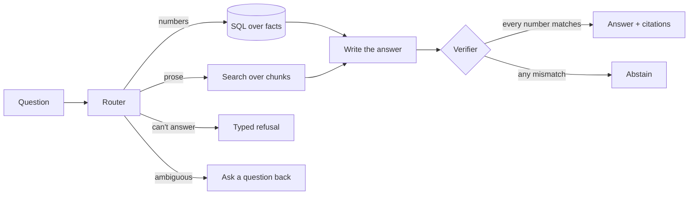

# The Whole Thing

**Read this first.** Every other doc in `learn/` explains one phase. This one explains the whole system, top to bottom, in plain words.

Seven stops. About 15 minutes.

---

## Stop 1 — What are we building?

**In one sentence:** ten US companies, every document they filed with the SEC over two years, and you can ask a question in plain English and get a correct, sourced answer — or an honest "I don't know."

That's the product. Here's why it isn't easy.

The obvious build takes an afternoon: dump the filings into a search index, retrieve some paragraphs, let an LLM write an answer. It demos beautifully. In finance it's dangerous, in five specific ways.

**1. The model does arithmetic.**
Ask for NVIDIA's Q4 revenue. Nobody ever published that number, so it has to be calculated. An LLM will produce a number. It will look right. Sometimes it will be wrong, and you won't be able to tell.

**2. It answers using the future.**
"As of September 2024, what was NVIDIA's latest revenue?" A naive system gives you a number that wasn't published until November. That's called **look-ahead bias**, and it's the difference between a trading strategy that works and one that lies to you.

**3. It assumes the past holds still.**
Johnson & Johnson spun off part of its business. First half of 2023 revenue, as JNJ reported it back then: **$50,276M**. The same period, as JNJ reports it today: **$42,413M**. Neither is a mistake. One is what was known then, one is what's known now.

**4. It can't say "that question is meaningless."**
JPMorgan is a bank. Banks don't have "gross profit" — the concept doesn't apply. A naive system computes something anyway.

**5. It thinks a year is a year.**
Microsoft's fiscal 2025 ended in June. Apple's ended in September. NVIDIA's ended in January. Same words, three different date ranges.

### What this does to the LLM's job

Here's the punchline:

> **In a system built this way, the language model does almost nothing.**

It doesn't search. It doesn't decide what kind of question you asked. It doesn't calculate. It doesn't pick citations. It writes sentences around numbers it was handed — and then a checker compares every number against the database and throws the answer away if even one doesn't match.

There is exactly **one** place in the whole codebase that calls a language model.

So the honest description of this project:

> A deterministic financial answering engine, with a language model bolted on at the end to make the output readable — and a verifier behind it that assumes the model is lying.

---

## Stop 1.5 — Wait, why is there math at all?

Good question. You'd think a filing-lookup system just looks things up. It can't, for four reasons.

**The calendar has a hole in it.** Companies file a report for Q1, Q2, Q3, and a full-year report. **Nobody files a Q4 report.** So Q4 revenue isn't written down anywhere and must be derived:

```
130,497   full year
 −26,044   Q1
 −30,040   Q2
 −35,082   Q3
 = 39,331  ← NVIDIA Q4 revenue, in millions
```

And you can only subtract things that add up. Revenue adds up across quarters. **Earnings per share does not.** So the code has a ladder of rules, and when none apply it says "I don't know" instead of guessing.

**The useful questions are about change, not level.** Nobody asks "what was revenue." They ask "did it grow." Growth, margins, and compound rates are **never** filed numbers — they're always computed.

**Comparing companies** means putting them on the same basis first.

**Rounding is arithmetic too.** The real margin is `0.4690…`; a human wants "46.9%".

### So why can't the LLM do it?

You said "it might hallucinate." True, but here's the precise reason:

**It fails silently.** If the model returns `39,133` instead of `39,331`, there is no error message, no crash, no red underline. A wrong financial number looks exactly like a right one. Every other bug in software announces itself. This one doesn't.

Three more: it isn't repeatable (you can't write a test for it), it leaves no audit trail (you can't see where it went wrong), and errors compound (a wrong Q4 poisons every growth figure built on it).

**The part that surprises people:** the code doesn't use ordinary decimal numbers either. Regular computer arithmetic has tiny rounding errors — `0.1 + 0.2` isn't exactly `0.3`. So the project uses exact decimal math throughout.

The real standard isn't "don't trust the LLM." It's **"money math must be exact, repeatable, and auditable."** That bar disqualifies the LLM *and* the default number type in Python. The LLM is just the least trustworthy name on a list where even basic arithmetic didn't make the cut.

---

## Stop 2 — The raw material

### What's on your disk

**477 MB**, three kinds of thing:

| | |
|---|---|
| `submissions/` | 10 files — each company's complete filing history |
| `companyfacts/` | 10 files — every number the company ever reported |
| `AAPL/ CAT/ …` | 350 folders, one per filing, holding the actual document |

### What one filing is

NVIDIA's entire annual report — hundreds of pages, audited — is **one 2 MB HTML file**. Open it in a browser and it's a normal document.

The trick: every number on that page is *also* invisibly tagged with machine-readable information saying what it means and what period it covers. One file, two audiences — a person reading a report, and a computer reading a database.

### The gift

You don't have to parse that HTML, because **the SEC already did it.** For every company they publish one JSON file containing every number that company ever tagged.

> NVIDIA: **26,903 numbers**, across **626 concepts**.

Free, no API key. **This is the only reason this project is buildable.** In most markets you'd be extracting tables from PDFs.

### The four things it refuses to give you

**1. The names aren't stable.**

NVIDIA's revenue, from your own data:

| Fiscal years | Tag NVIDIA used |
|---|---|
| 2019 – 2022 | `RevenueFromContractWithCustomerExcludingAssessedTax` |
| 2025 | `Revenues` |

Same company. Same line. Different name. If you'd hardcoded the first one, NVIDIA's revenue would silently vanish from your system — no error, just gone.

Across all ten companies, six use one tag and four use the other. **There is no such thing as "the revenue field."** That's why `fixtures/metric_mappings.yaml` exists — it's the only way the word "revenue" resolves to anything.

**2. The period labels lie.**

A real row from NVIDIA's file:

```
2017-01-30 → 2017-04-30    $1.937B    fy=2019   fp=FY
```

The dates describe **three months in 2017**. The labels say **annual, 2019**. Both on the same row. The labels describe *the report the number appeared in*, not the number's own period — and an annual report contains years of history, all inheriting its label.

Trust the labels and you file a quarter as a year. Off by 4×.

**3. There are no segment breakdowns.**

Every field that ever appears on a number: `accn, end, filed, form, fp, frame, fy, start, val`.

No dimensions. So *"how much of NVIDIA's revenue came from Data Center?"* is **not answerable from this file**, for any company. That breakdown exists inside the filing, but the SEC's summary flattens it away.

**4. No Q4, and not one word of prose.**

Zero text. No risk factors, no management discussion. That's why the system has two separate pipelines — one for numbers, one for words.

### And the calendars are worse than advertised

The ten fiscal year-ends:

```
MSFT  Jun 30      COST  Aug 31      AAPL  Sep 27
DE    Nov 02      JNJ   Dec 28      CAT   Dec 31
JPM   Dec 31      XOM   Dec 31      NVDA  Jan 25
WMT   Jan 31
```

A **seven-month spread**. And notice `Sep 27`, `Dec 28`, `Nov 02` — those aren't month-ends. Those companies end their year on a fixed weekday, so the date drifts annually and every few years a quarter has **14 weeks instead of 13**. Compare that quarter to last year without knowing, and you'll report 8% "growth" that is purely calendar.

---

## Stop 3 — The store

### Every fact carries two different times

This is the central idea of the whole system.

| | |
|---|---|
| **Period** | What slice of the world the number describes — "revenue for May–July 2024" |
| **Knowledge time** | When the world *learned* it — the exact moment the SEC accepted the filing |

Most databases only have the first. Having both is what lets you ask *"what did we know on this date?"* and get an honest answer.

Knowledge time is deliberately **not** "the date on the filing" (too vague) and **not** "when we downloaded it" (that's our time, not the world's).

### Nothing is ever edited or deleted

When a company restates the past, the old number doesn't get overwritten. The new number is added as a new row, and the old row gets a pointer to it saying *"this was replaced by that."*

The JNJ case, real:

```
$50,276M   reported Jul 2023   ← still in the database, still answerable
     ↓ replaced by
$42,413M   reported Jul 2024
```

Both survive. Ask "what did JNJ report for H1 2023?" and you get $50,276M. Ask "what does JNJ say H1 2023 was?" and you get $42,413M. **Both answers are correct** — they're answers to different questions.

The database physically refuses edits and deletes. The only change allowed is setting that "replaced by" pointer.

### The query that all of this exists for

```sql
SELECT value FROM facts
WHERE company = ? AND concept = ? AND period_end = ?
  AND knowledge_time <= :as_of      -- only what was knowable then
ORDER BY knowledge_time DESC        -- the most recent of that knowledge
LIMIT 1;
```

That's it. Two lines of filtering, and look-ahead bias becomes structurally impossible rather than something you have to remember to avoid.

---

## Stop 4 — Finding the words

Numbers come from the database. Prose needs search.

### Chunking

The filings' text is split into **7,033 pieces**, roughly a page each, with a bit of overlap so a sentence sitting on a boundary appears whole somewhere.

One rule matters: **never merge text across a section boundary.** A chunk that's half risk-factors and half management-discussion poisons search — a match on one half drags the unrelated other half along with it.

### Two kinds of search, because each one fails

| | Good at | Bad at |
|---|---|---|
| **Meaning search** | Finding "supply chain concentration" in a paragraph that never uses those words | Exact names and odd terms |
| **Keyword search** | Exact strings — "Kenvue", "10-for-1 split" | Anything phrased differently |

So we run both and merge the two ranked lists. Measured on 60 test questions:

| | Score |
|---|---|
| **Both merged** | **0.71** |
| Meaning only | 0.63 |
| Keywords only | 0.15 |

Merged beats either one alone. That's the whole justification, and it's measured rather than assumed.

### Text obeys the same time rules

Every chunk carries the knowledge time of the filing it came from, so the as-of filter applies to prose exactly as it does to numbers. A test checks all 60 questions for time leaks. Currently: **zero**.

---

## Stop 5 — Answering



**The router** decides what kind of question it is. It's plain rules, not a model — auditable, testable, and it can *structurally* prevent the one dangerous mistake: sending a numeric question down the text-only path. Scores **100%** on all 60 test questions.

**The two branches** are the two pipelines from Stop 2. Numbers come from the facts database. Prose comes from search.

**Writing the answer** is the one place a language model is used — and every number in the output is filled in from the database, not generated.

**The verifier** is the part that matters. It checks that every number in the answer exactly matches what the database returned, that the citation points at the right filing, and that no number was emitted for a metric the system was supposed to abstain on. Any failure and the answer is thrown away.

### What it actually scores

| | |
|---|---|
| Numeric questions exactly right | **17 / 18** |
| Questions that should be refused, refused | **100%** |
| Numbers with a citation | **100%** |
| Time leaks | **0** |
| Router accuracy | **100%** |

The one miss is a Caterpillar Q4 figure where our calculated value disagrees with a rounded press-release number — a reconciliation item, not a bug.

---

## Stop 6 — Where you actually are

M0 — the first complete working milestone — is **built and passing**.

| Phase | | Status |
|---|---|---|
| 0 | Scaffolding, database, test rails | ✅ |
| 1 | The facts store | ✅ |
| 2 | Loading the data | 🔴 5 of 9 checks |
| 3 | Test questions + search | 🔴 4 of 5 checks |
| 4 | The numbers engine | ✅ |
| 5 | Router + answering + verifying | ✅ |

The pipeline works end to end. What's loaded: **389 documents, 41,175 numbers, 7,033 text chunks**.

### The five open items — all of them are you

Everything still red is a human verification task, not code:

| | What | Why it can't be automated |
|---|---|---|
| 1 | Check 20 numbers against the real filings by hand | Proves the loader isn't systematically wrong |
| 2 | Confirm the 60 test questions' answers | These become the permanent scorecard |
| 3 | Verify ~80 press-release numbers, then load them | An LLM extracted them; nothing enters the database unverified |
| 4 | Countersign the JNJ restatement case | It's the proof the "past changes" machinery actually fires |
| 5 | Get a free Tiingo key for price data | Optional — nothing currently reads prices |

All of this is pre-assembled into one checklist: **`learn/verification_guide.md`**.

### Why "provisional" matters

Right now the system scores well **against answers it partly wrote itself.** That's not worthless — it catches regressions — but it isn't proof of correctness. Once you've verified them, those answers get frozen, and from then on every future change is measured against a scorecard a human confirmed.

That's the difference between "the tests pass" and "the tests mean something."

---

## Stop 7 — Where you're going

After verification, five learning projects (L1–L5) and two showcase steps, in this order:

| | | What you learn |
|---|---|---|
| **Showcase 1** | README | Explaining the project to someone who will only read the front page — with real numbers |
| **L1** | Observability + cost + answer grading | Debugging from logs alone; what each answer actually costs; using a second AI model to check the written answers stick to the sources — and testing that checker against your own grades first |
| **Showcase 2** | Demo page + video | Showing the system working — answer, sources and the step-by-step record — to someone who won't install anything |
| **L2** | Chunking eval | How the size of the text pieces changes what search can find — checked against the exact answer sentence, not just the right section |
| **L3** | Reranker | A slow, smart second pass over search results — and measuring whether it helped |
| **L4** | GraphRAG | Building a knowledge graph, and honestly deciding whether it earns its keep |
| **L5** | Monitoring | Alerts when a watched company files something important — and scoring whether the alerts are worth reading |

Deliberately cut: the web API, embedding fine-tuning, news ingestion, real-time data. The reasoning is in `DECISIONS.md #15` — those are generic web engineering and ML side-quests, not transferable retrieval skill. `DECISIONS.md #16` added the chunking eval; `#17` added answer grading and the two showcase steps. The demo page is one local page, not the cut web API.

---

## So — does this project make sense?

**Yes, with one honest caveat.**

**The problem is real.** Every difficulty above is genuine and would silently break a naive system. Nothing was invented to make this look hard.

**But be clear about what phases 0–5 taught you.** Roughly 70% of the work so far was *financial data engineering* — time-aware storage, identity resolution, calendars, deterministic queries. Valuable and rare, but if your goal was "learn RAG," a lot of it was adjacent. The retrieval-specific content is mostly Phase 3 alone.

**You already noticed this.** `DECISIONS.md #15` pivots everything after M0 toward exactly the retrieval-specific skills.

**Why finish rather than restart:** the expensive, boring part is done. You have test questions, automated checks, and a verifier — which means you can **measure whether a change actually helped.** Almost nobody building retrieval systems can do that. They ship a reranker, it feels better, and nobody knows. L2, L3 and L4 exist to produce improvement numbers, and improvement numbers are only meaningful on a foundation you trust.

You built the ruler before the thing being measured. That's the right order, and it's the step everyone skips.

**One honest limitation:** the corpus is small — 7,033 chunks, 10 companies, 2 years. GraphRAG in particular may show little benefit at that size. Go in expecting to learn the technique and measure honestly, possibly concluding "not worth it here." Your own syllabus already lists that as the point: *proving you don't need to build something* is a real skill.

---

## The one-paragraph version

Ten companies' SEC filings become two things: **exact numbers** in a database that records not just what was true but *when we learned it*, and **searchable text** that obeys the same time rules. A question is routed to one or both, the numbers are computed by code rather than by a model, a language model writes the sentences around them, and a verifier throws the whole answer away if a single number doesn't match the database. When the system can't answer honestly, it says so. That last part is the feature that took the most work.
